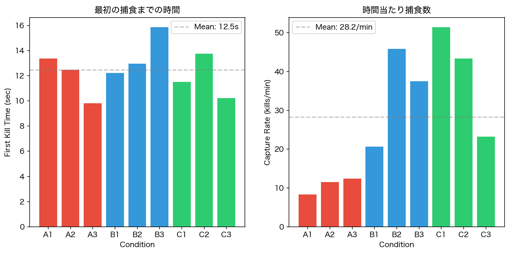
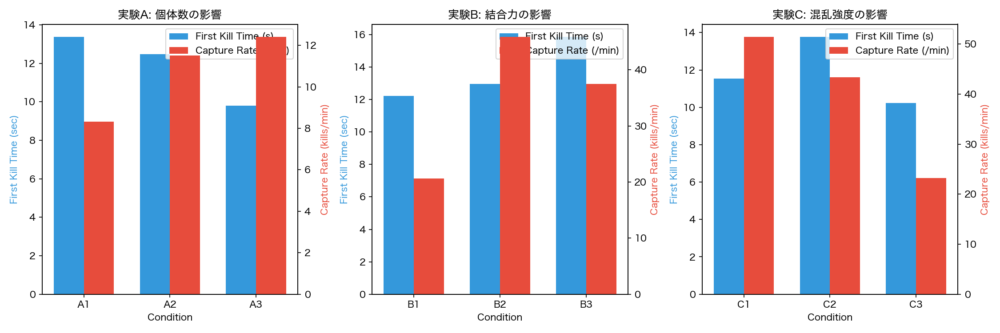
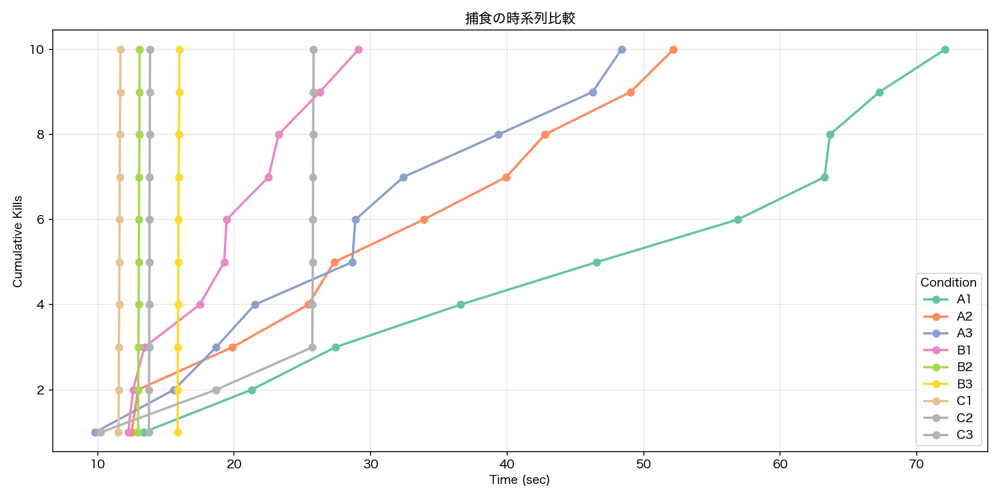
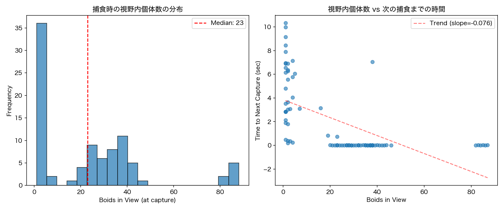

# 群れ行動シミュレーションにおける Confusion Effect の検証

## 1. 緒言

### 1.1 背景

魚類や鳥類をはじめとする多くの動物種において、群れを形成して行動する現象が広く観察されている。群れ行動には捕食者からの防御、採餌効率の向上、移動コストの削減といった複数の適応的意義が提唱されてきた。捕食回避の文脈では、希釈効果、多数の目効果、および混乱効果（Confusion Effect）が主要な防御機構として議論されている。

Confusion Effect とは、捕食者が多数の潜在的標的に直面した際に、特定個体の選択および追跡が困難になる現象を指す。Ioannou et al. (2008) は人工ニューラルネットワークを用いた実験により、視野内の標的数増加に伴い追跡精度が低下することを報告した。また、捕食者が「最後に視野に入った個体」へ注意を移す傾向（以下、目移り行動）も観察されている。

本研究では、コンピュータシミュレーションによりこれらの知見を再現し、群れパラメータが捕食成功率に及ぼす影響を定量的に評価することを目的とした。

### 1.2 目的

本研究の目的は以下の3点である。第一に、Boid アルゴリズムに基づく群れシミュレーションを構築し、Confusion Effect を実装すること。第二に、群れの個体数、密度、および混乱強度が捕食効率に与える影響を定量化すること。第三に、Ioannou et al. (2008) の知見をシミュレーション上で検証することである。

<div class="page"/>

## 2. 方法

### 2.1 シミュレーション環境

シミュレーションは Unity 2022.3 LTS 上で C# により実装した。空間は原点を中心とする半径 50 m の球形領域とし、被捕食者および捕食者はこの領域内で行動する。球形空間を採用した理由は、矩形空間における壁面衝突時の群れ崩壊を回避し、より自然な回遊行動を実現するためである。

### 2.2 システム設計における工夫

#### 2.2.1 Confusion Effect の実装

Ioannou et al. (2008) の Fig.2 に示された捕食者行動を再現するため、以下の機能を実装した。

視野内個体数 $n$ に基づき混乱度 $C$ を算出する。

$$C = \min\left(1, \frac{n}{n_{max}}\right) \times s$$

ここで $n_{max}$ は最大混乱個体数（本実験では10）、$s$ は混乱強度パラメータである。混乱度に応じて追跡角度のずれ、旋回速度の低下、および移動速度の低下が生じる。

```csharp
float rawConfusion = Mathf.Clamp01((float)currentBoidsInView / maxConfusionCount);
currentConfusion = rawConfusion * confusionStrength;
```

#### 2.2.2 目移り行動とクールダウン機構

論文に記載された目移り行動を忠実に再現した場合、捕食者は頻繁にターゲットを切り替え、捕食に至らない状況が多発した。この問題を解決するため、ターゲット切り替え後 1.5 秒間は新規個体への切り替えを抑制するクールダウン機構を導入した。

```csharp
float timeSinceSwitch = Time.time - lastSwitchTime;
bool cooldownOver = timeSinceSwitch > targetSwitchCooldown;
```

#### 2.2.3 追跡精度の低下

混乱時の追跡精度低下には Perlin Noise を用いた。これにより、時間的に滑らかな角度変動が生成され、より自然な「迷い」が表現される。

```csharp
float noiseX = Mathf.PerlinNoise(Time.time * 1.5f, 0f) - 0.5f;
float deviationH = maxAngleDeviation * currentConfusion * noiseX * 2f;
```

#### 2.2.4 境界制御

境界付近では中心方向への誘導力を付与し、境界外への逸脱時には強制的に押し戻す3段階の制御を実装した。

#### 2.2.5 データ収集

10匹捕食時点で実験を自動終了し、捕食イベントおよび群れ状態を CSV 形式で出力する機能を実装した。

<div class="page"/>

## 3. アルゴリズム

### 3.1 被捕食者モデル

被捕食者の運動は Reynolds (1987) の Boid アルゴリズムに基づく。各個体は近傍個体の位置と速度を参照し、3種類の力の重ね合わせにより加速度を決定する。

| 力 | 内容 |
|---|---|
| Alignment | 近傍個体の平均速度方向へ向かう |
| Cohesion | 近傍個体の重心へ向かう |
| Separation | 近接個体から離れる |

加えて、捕食者が 15 m 以内に接近した場合、逃避方向への力（重み 15.0）が付与される。

### 3.2 捕食者モデル

#### 3.2.1 視野判定

捕食者は視野半径 20 m、視野角 120°、後方死角 40° の視覚系を持つ。各フレームにおいて全被捕食者をスキャンし、視野内個体を検出する。

#### 3.2.2 ターゲット選択

ターゲット選択は以下の優先順位に従う。現在のターゲットが視野外となった場合、または追跡距離が 15 m を超過した場合は新規ターゲットを選択する。クールダウン終了後に新規個体が視野に進入した場合、当該個体へ切り替える。それ以外の場合は現在のターゲットを維持する。

#### 3.2.3 混乱効果

混乱度に応じて以下の影響が適用される。

| 効果 | 計算式 |
|---|---|
| 追跡角度のずれ | $\delta = \delta_{max} \times C \times \text{Noise}$ |
| 旋回速度 | $\omega_{eff} = \omega_{base} \times (1 - 0.5C)$ |
| 移動速度 | $v_{eff} = v_{base} \times (1 - 0.15C)$ |

<div class="page"/>


## 4. 実装

### 4.1 クラス構成

| クラス | 機能 |
|---|---|
| Boid | 被捕食者の行動制御 |
| BoidSettings | 群れパラメータの管理 |
| ConfusionPredator | 捕食者の行動制御 |
| ExperimentLogger | 実験データの記録 |
| Spawner | 初期配置の生成 |

### 4.2 主要メソッド

UpdateTarget() は毎フレーム呼び出され、視野内個体の検出、混乱度の計算、およびターゲット選択を行う。Move() はターゲット方向への移動と捕食判定を担当する。

```csharp
void UpdateTarget() {
    foreach (Boid b in allBoids) {
        Vector3 toBoid = b.transform.position - transform.position;
        float dist = toBoid.magnitude;
        float angle = Vector3.Angle(transform.forward, toBoid);
        
        if (dist < viewRadius && angle < viewAngle / 2f) {
            currentInView.Add(b);
            if (!boidsInViewLastFrame.Contains(b)) {
                newlyEnteredBoids.Add(b);
            }
        }
    }
    currentConfusion = Mathf.Clamp01(currentBoidsInView / maxConfusionCount) 
                       * confusionStrength;
}
```

<div class="page"/>

## 5. 結果

### 5.1 実験条件

3種類の実験を実施した。実験 A では初期個体数（20, 50, 100匹）を操作した。実験 B では結合力パラメータ（1, 5, 15）を操作した。実験 C では混乱強度（0, 0.5, 1.0）を操作した。

| 群 | 操作変数 | 水準 |
|---|---|---|
| A | 初期個体数 | 20, 50, 100 |
| B | 結合力 | 1, 5, 15 |
| C | 混乱強度 | 0, 0.5, 1.0 |

### 5.2 測定結果

| 条件 | 個体数 | 結合力 | 混乱強度 | 初回捕食時間 (s) | 捕食率 (/min) |
|------|--------|--------|----------|------------------|---------------|
| A1 | 20 | 1 | 0.5 | 13.37 | 8.33 |
| A2 | 50 | 1 | 0.5 | 12.49 | 11.50 |
| A3 | 100 | 1 | 0.5 | 9.81 | 12.40 |
| B1 | 100 | 1 | 0.5 | 12.24 | 20.61 |
| B2 | 100 | 5 | 0.5 | 12.96 | 45.86 |
| B3 | 100 | 15 | 0.5 | 15.86 | 37.52 |
| C1 | 100 | 5 | 0 | 11.53 | 51.41 |
| C2 | 100 | 5 | 0.5 | 13.76 | 43.37 |
| C3 | 100 | 5 | 1.0 | 10.23 | 23.24 |

### 5.3 グラフ

#### 図1 条件間比較



図1に各条件の比較を示す。左図は初回捕食時間、中央図は捕食率、右図は10匹捕食までの所要時間である。色は実験群を表し、赤が A 群（個体数）、青が B 群（結合力）、緑が C 群（混乱強度）に対応する。

C 群において捕食率の条件間差が最も顕著であり、混乱強度の影響が大きいことが示された。A 群は全体的に捕食率が低く、疎な群れでは捕食効率が低下する傾向が認められた。

---

#### 図2 実験群別の傾向



図2に各実験群の傾向を示す。青色のバーは初回捕食時間（左軸）、赤色のバーは捕食率（右軸）を表す。

実験 A では個体数の増加に伴い捕食率が上昇した（8.33 → 12.40 /min）。これは疎な群れにおいて、個体数増加が発見確率の上昇をもたらしたためと考えられる。

実験 B では結合力 5 の条件で捕食率が最大（45.86 /min）となり、結合力 15 では低下した（37.52 /min）。高密度群れでは Confusion Effect が発揮され、捕食効率が抑制されたと解釈できる。

実験 C では混乱強度の増加に伴い捕食率が単調に減少した（51.41 → 23.24 /min）。混乱強度 1.0 では混乱強度 0 と比較して 55% の低下が認められた。

---

#### 図3 捕食の時系列



図3に累積捕食数の時間推移を示す。横軸は経過時間（秒）、縦軸は累積捕食数である。

C1（混乱なし）は約12秒で10匹に到達し、最も急峻な勾配を示した。一方、A1（20匹群れ）は約72秒を要し、最も緩やかな推移となった。曲線の傾きは捕食効率を反映しており、C1 および B2 では連続捕食が発生していることが読み取れる。

---

#### 図4 Confusion Effect の検証



図4左図に捕食成功時の視野内個体数分布を示す。中央値は23匹であり、視野内個体数が少ない状況（0〜5匹）での捕食が頻発している。これは群れ周縁部や孤立個体が捕食されやすいことを示唆する。

図4右図は視野内個体数と次回捕食までの時間間隔の関係を示す。回帰直線の傾きは -0.076 であり、弱い負の相関が認められた。視野内個体数が多い状況では次の獲物が近傍に存在するため、連続捕食が生じやすいと解釈できる。ただし本データは捕食成功時のみを集計しているため、Confusion Effect による捕食失敗は反映されていない点に留意が必要である。

---

## 6. 考察

### 6.1 仮説の検証

| 仮説 | 結果 | 判定 |
|------|------|------|
| 個体数増加により捕食率が低下する | 逆の傾向 | 棄却 |
| 高密度群れで捕食率が低下する | 部分的に支持 | 部分的支持 |
| Confusion Effect により捕食率が低下する | 55%低下 | 支持 |

### 6.2 Confusion Effect について

実験 C の結果から、Confusion Effect の有効性が確認された。混乱強度 0 から 1.0 への増加に伴い、捕食率は 51.41 から 23.24 /min へと 55% 低下した。この結果は Ioannou et al. (2008) の報告と整合する。

### 6.3 群れ密度の影響

実験 B では結合力と捕食率の関係が非単調であった。結合力 5（中程度の密度）で捕食率が最大となり、結合力 15（高密度）では低下した。高密度群れでは視野内個体数が増加し、Confusion Effect が発揮されたと考えられる。一方、結合力 1（疎な群れ）では個体が分散し、連続捕食が困難であった。

### 6.4 個体数の影響

実験 A では仮説に反し、個体数増加に伴い捕食率が上昇した。これは結合力 1 という疎な群れ条件において、個体数増加が発見確率の上昇に寄与し、Confusion Effect の効果を上回ったためと解釈できる。群れによる防御効果を発揮するには、十分な密度での凝集が必要であることが示唆された。

### 6.5 限界と課題

本研究にはいくつかの限界がある。第一に、各条件 1 回の試行であり、統計的検定は実施していない。第二に、実験 A, B, C 間で基準パラメータが異なるため、条件間の直接比較には注意を要する。第三に、10匹捕食時点での打ち切りにより、群れサイズ減少時の効果は未検証である。

---

## 7. 結論

本研究では Boid アルゴリズムに基づく群れシミュレーションを構築し、Confusion Effect を実装・検証した。得られた知見を以下に要約する。

Confusion Effect は捕食率を最大 55% 低下させ、その有効性が確認された。群れ密度と捕食率の関係は非単調であり、高密度条件で Confusion Effect が発揮された。疎な群れでは個体数増加が発見確率の上昇をもたらし、かえって捕食率が上昇した。以上の結果は、密集した群れ形成が捕食者に対する有効な防御戦略となりうることを示唆している。

---

## 謝辞

本研究で使用したシミュレーション環境は、伊庭研究室が作成・配布している Boid シミュレーションソフトウェアを基盤としている。元のソフトウェアは Sebastian Lague 氏による実装（MIT License）に基づき、伊庭研究室により改変・整備されたものである。ここに謝意を表する。

---

## 使用ソフトウェアと本検証での改変点

### 元のソフトウェア

本研究では伊庭研究室が配布する Boid シミュレーションソフトウェアを使用した。元のソフトウェアには以下の機能が実装されていた。

- Reynolds (1987) に基づく Boid アルゴリズム（Alignment, Cohesion, Separation）
- ComputeShader による並列計算
- 障害物回避機能
- 複数種の群れ表示

### 本研究で追加・改変した機能

本研究では上記ソフトウェアを基盤とし、以下の機能を新規に実装した。

1. **捕食者モデル（ConfusionPredator.cs）の実装**
   - Ioannou et al. (2008) の論文 Fig.2 に基づく目移り行動
   - 視野内個体数に応じた混乱度の計算
   - 混乱度に応じた追跡精度の低下（Perlin Noise による角度ずれ）
   - クールダウン機構によるターゲット切り替え制御

2. **被捕食者の逃避行動（Boid.cs への追加）**
   - 捕食者検知時の回避力の付与
   - 球形空間への境界制御

3. **実験データ収集システム（ExperimentLogger.cs）の実装**
   - 捕食イベントの CSV 出力
   - 群れ状態のスナップショット記録
   - 自動実験終了機能

4. **実験条件の管理**
   - 条件選択用の列挙型
   - パラメータの記録と出力

---

## 参考文献

1. Ioannou, C. C., Tosh, C. R., Neville, L., & Krause, J. (2008). The confusion effect—from neural networks to reduced predation risk. *Behavioral Ecology*, 19(1), 126-130.

2. Reynolds, C. W. (1987). Flocks, herds and schools: A distributed behavioral model. *ACM SIGGRAPH Computer Graphics*, 21(4), 25-34.

3. Couzin, I. D., Krause, J., James, R., Ruxton, G. D., & Franks, N. R. (2002). Collective memory and spatial sorting in animal groups. *Journal of Theoretical Biology*, 218(1), 1-11.

4. Sebastian Lague. Boids. https://github.com/SebLague/Boids (MIT License).
